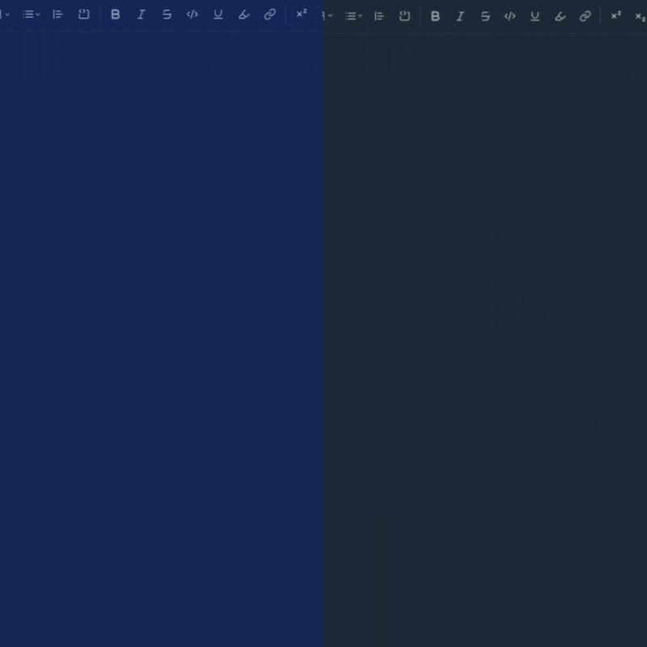

# Welcome to DocTap

A modern tool to keep track of finances and not be left behind

visit it here

## Features

- rich document editor
- manage your documents and store them safely
- collaborate with your team

## Getting Started

### Installation

clone the repo

```bash
git clone https://github.com/DanielJaffritz/DocTap.git

```

I recommend installing pnpm

```bash
npm install -g pnpm
```

install the dependencies:

```bash
pnpm install
```

configuration:

- Go to [google Oauth](https://developers.google.com/identity) and get your client id and client secret for the app.
- Go to [neon database](https://neon.com/docs/guides/javascript#deleting-data) and create your own database.
- Optional: Go to [resend](https://resend.com/login) and get your resend api key

Generate better auth secret:

```bash
openssl rand -base64 32
```

create your .env file based on the .env.example file.

run the app with

```bash
pnpm dev:all
```

Your application will be available at <http://localhost:3000>

Create a production build:

```bash
pnpm build
```

To build and run using Docker:

```bash
docker build -t DocTap .
```

Run the container:

```bash
docker run -p 3000:3000 DocTap
```

The containerized application can be deployed to any platform that supports Docker, including:

AWS ECS
Google Cloud Run
Azure Container Apps
Digital Ocean App Platform
Fly.io
Railway
DIY Deployment
If you're familiar with deploying Node applications, the built-in app server is production-ready.

Make sure to deploy the output of pnpm build

```bash
├── package.json
├── package-lock.json (or pnpm-lock.yaml, or bun.lockb)
├── build/
│   ├── client/    # Static assets
│   └── server/    # Server-side code
```

## Stack used

- NextJS App Router.
- TailwindCSS.
- NEON database.
- Prisma.
- Hocuspocus.
- Yjs.
- TipTap.
- Google OAuth.


